# 🍕 PizzaShop - Restaurant Management System

PizzaShop is a role-based restaurant management system built using **ASP.NET MVC** and **PostgreSQL**. It simplifies and digitizes restaurant operations such as menu management, table and section organization, order processing, role-based access control, tax configuration, and modifier handling.

This project supports multiple user roles: **Super Admin**, **Account Manager**, and **Chef** — each with tailored dashboards and permissions.

---

## 🚀 Key Features

- 🔐 **Role-Based Access (RBAC)**  
  Super Admin, Account Manager, and Chef dashboards with permission control for views, edits, and deletions.

- 🍽️ **Menu Management**  
  Manage food categories, items, modifier groups, and individual modifiers.

- 🪑 **Table & Section Management**  
  Add, update, and soft-delete sections and tables with real-time status (Available, Occupied).

- 🧾 **Order Management (KOT)**  
  End-to-end flow from table assignment to order completion, with status tracking.

- 👥 **Customer Management**  
  Create customers during table assignment and view history in the dashboard.

- 💰 **Tax & Fee Configuration**  
  Manage multiple tax types and apply defaults to items.

- 📊 **Dashboard Insights**  
  Tiles and charts for sales, new customers, top/least selling items, and waiting list.

- 📥 **Export to Excel**  
  Download detailed reports of orders and customers with filters and date ranges.

---

## 🛠️ Technology Stack

### Backend
- 
- 
- Entity Framework (EF)

### Frontend
- Razor Views + jQuery
- Bootstrap for UI components
- HTML, CSS, JavaScript

---

## 📸 Screenshots

### 🏠 Dashboard  
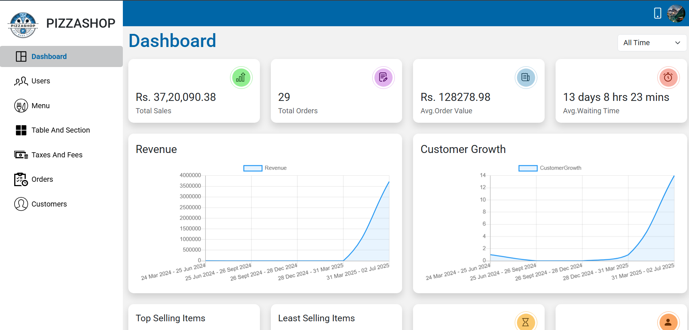

### 👤 Profile  
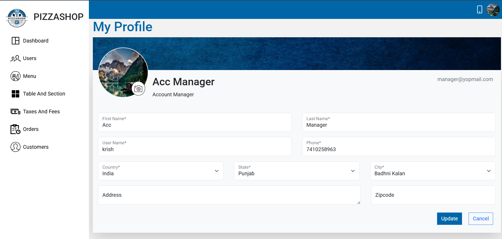

### 👥 Users Management  
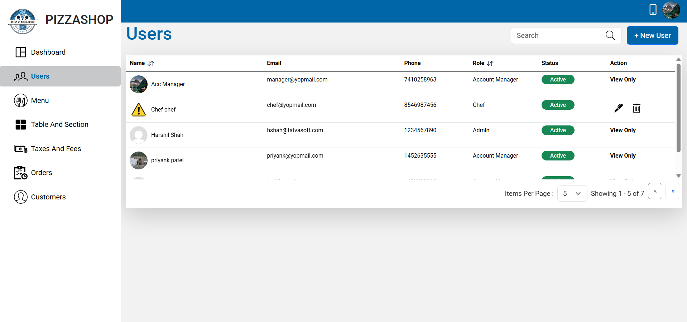

### 🍕 Menu Management  
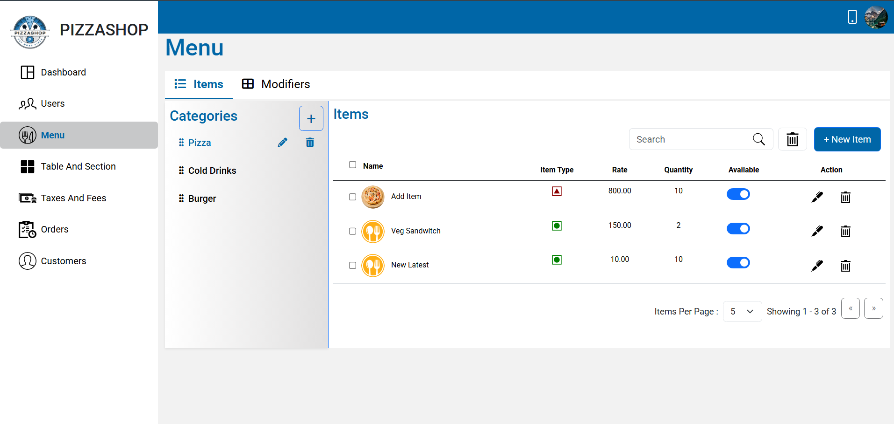

### 🧑‍🍳 Modifier Groups  
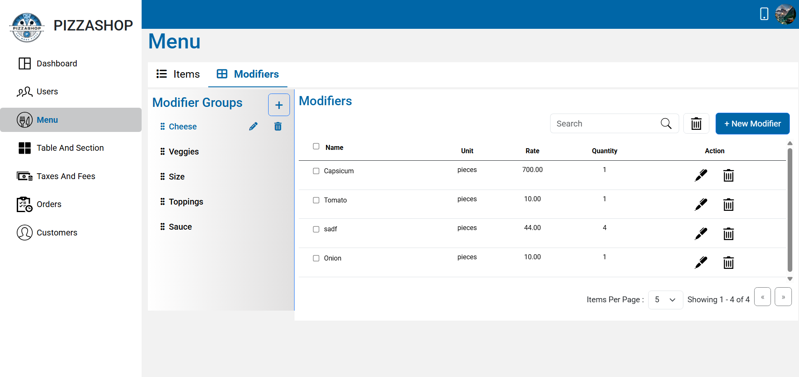  
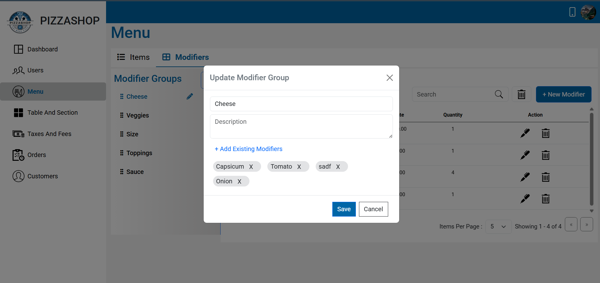  
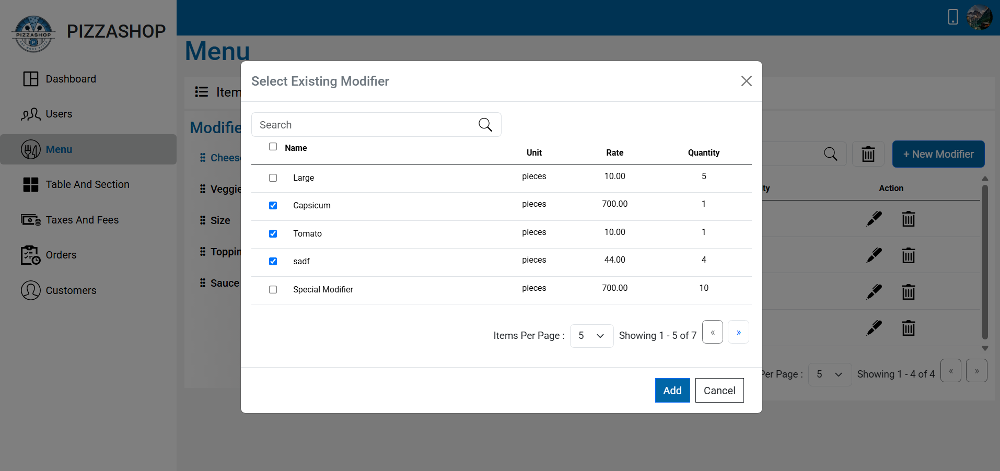  


### 🍽️ Table & Section Management  
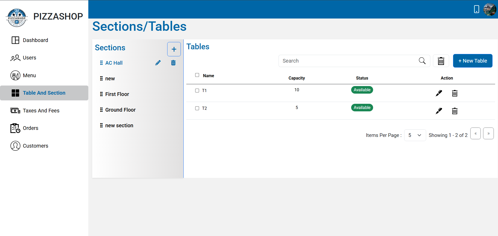

### 💰 Taxes & Fees  
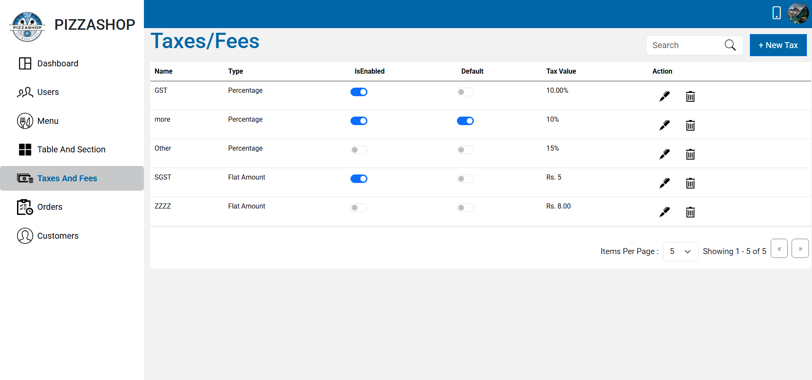

### 🧾 Orders  
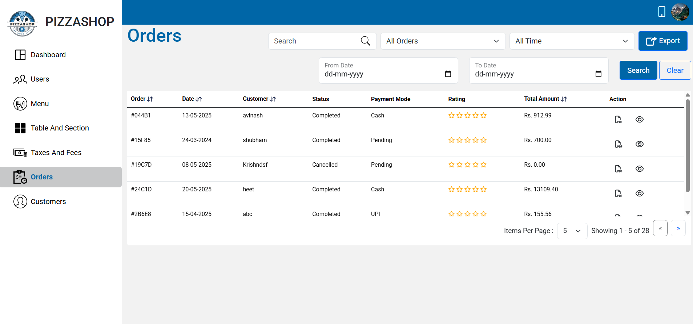

### 📲 Order App Flow (KOT)  
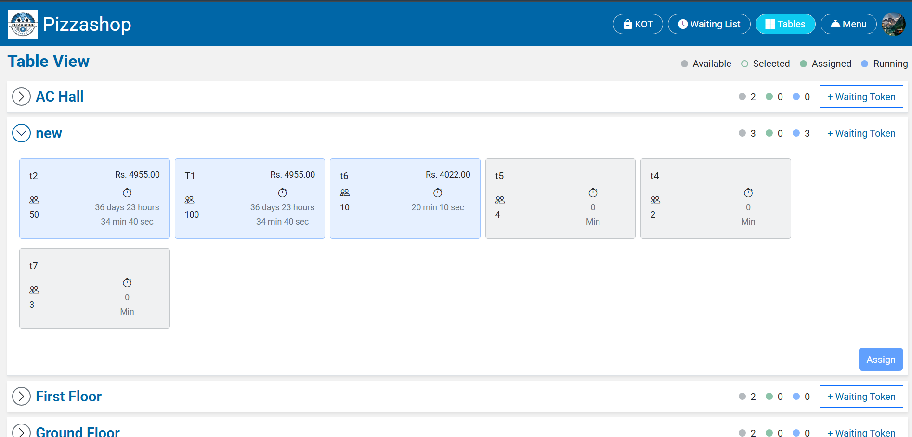  
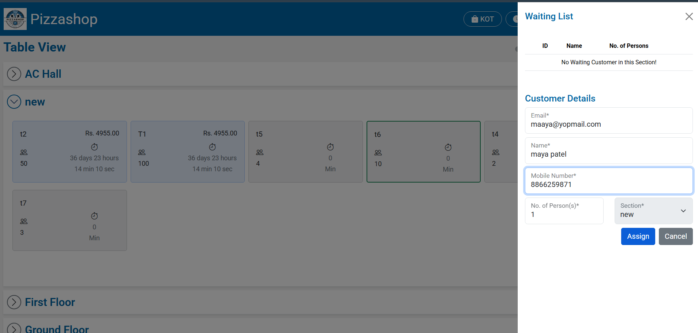  
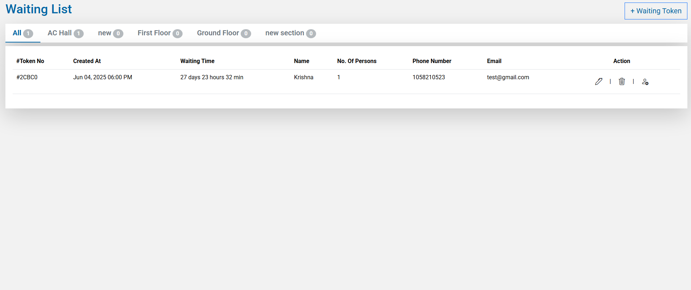  
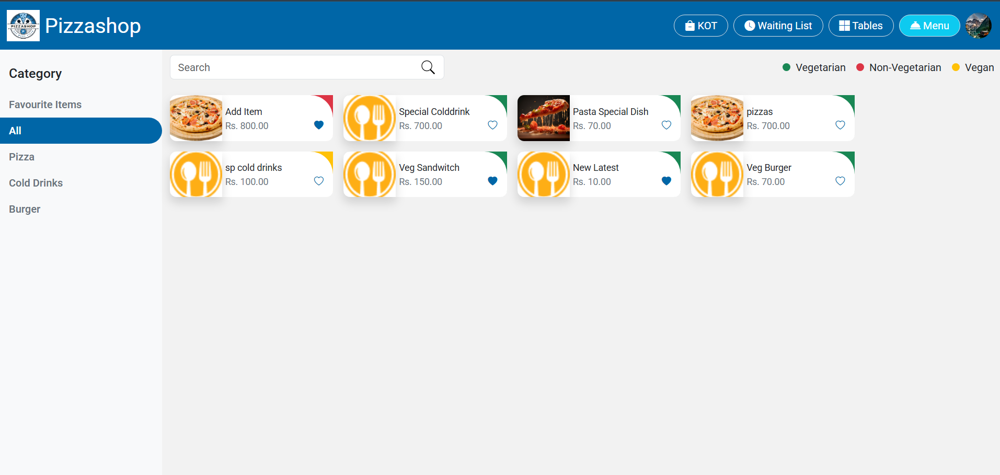  
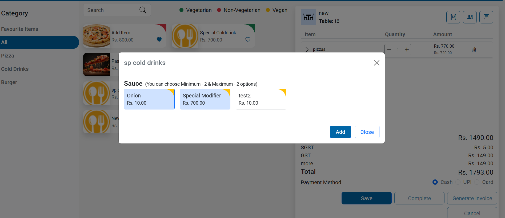  
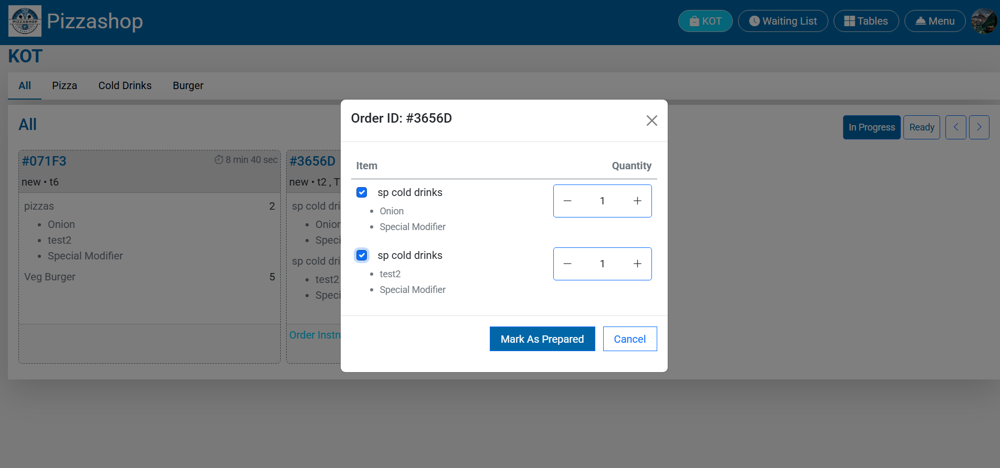


---

## ⚙️ Getting Started

### 1. Clone the Repository

```bash
git clone https://github.com/your-username/PizzaShop.git
cd PizzaShop
